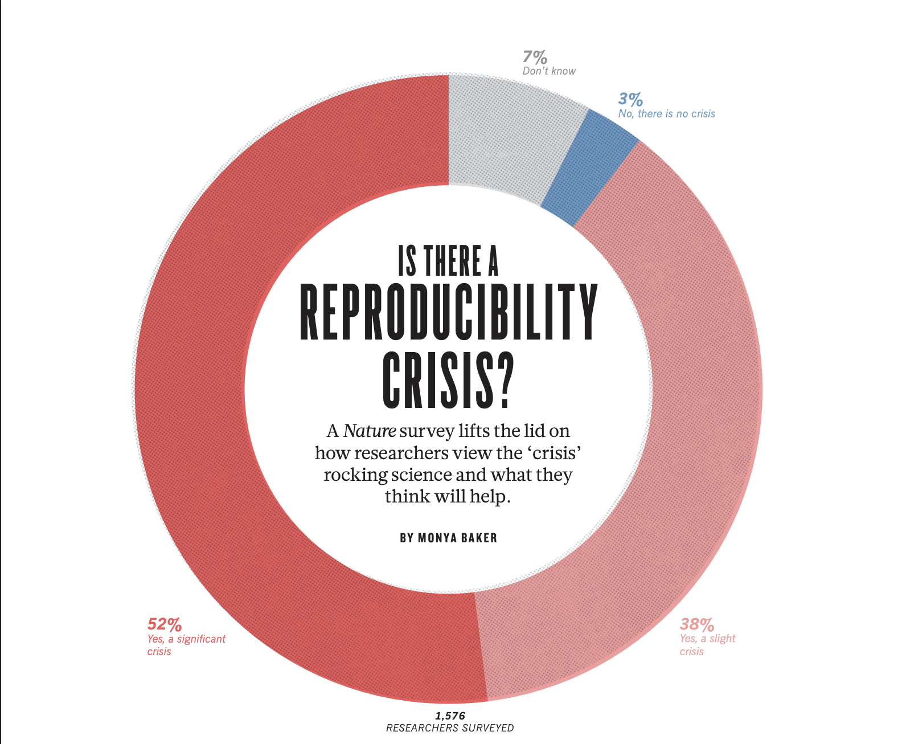
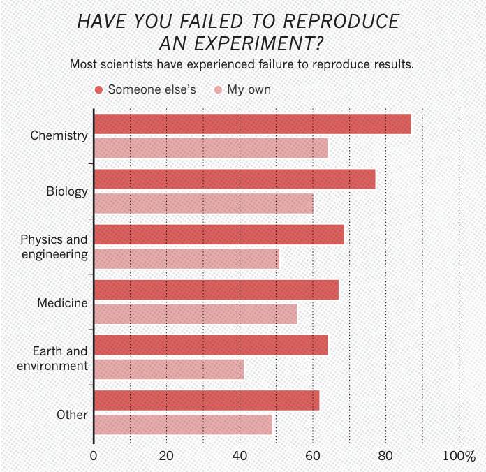

# Research Computing Training


## Presentor

Serena Caplins

Associate Bioinformatician

[Research Computing](https://rc.northeastern.edu/research-computing-team/)

## Scientific Reproducibility: Best Practices and Implementation

This training module provides a comprehensive introduction to scientific reproducibility, covering fundamental concepts, best practices, and practical implementation strategies. Whether you're a graduate student beginning your research journey or an established researcher looking to enhance your workflow, this guide will help you create more reliable, transparent, and reproducible research.

**Duration:** Approximately 60 minutes  
**Level:** Beginner to Intermediate  

---

## Table of Contents

1. [Introduction to Scientific Reproducibility](#introduction)
2. [Key Concepts and Why It Matters](#key-concepts)
3. [Best Practices Overview](#best-practices)
4. [Version Control with Git](#version-control)
5. [Software suggestions](#software)
6. [Building Conda Environments](#conda-environments)
7. [Data Management Essentials](#data-management)
8. [Documentation Standards](#documentation)
9. [Hands-on Exercises](#exercises)
10. [Resources and Further Reading](#resources)

---

## 1. Introduction to Scientific Reproducibility {#introduction}

Scientific reproducibility is the ability of independent researchers to obtain consistent results using the same methods, data, and analysis procedures as the original study. It is a cornerstone of the scientific method and essential for validating research findings.

In 2016 a Nature survey found that most researchers are unable to reproduce other researchers results (survey shown below).




With this training we hope to give you a few tools to increase the reproducibility of your research.



## The first person you are helping here is yourself. 

In every research project that I have done, as some point something needs to be repeated (an analyses or regenerate a plot).The more reproducibile your workflow is the better you will be at redoing (at any time) anything that you have done in the past. This will help you publish more efficiently!

## Three part training series on Reproducibility

Scientific Reproducibility 2: Version Control
March 10, 2026 | 1:00 pm - 2:00 pm

Scientific Reproducibility 3: Containers
May 12, 2026 | 1:00 pm - 2:00 pm

### Learning Objectives

By the end of this training, you will be able to:

- Understand the difference between reproducibility, replicability, and repeatability
- Identify common reproducibility challenges in research
- Implement version control systems for code and documents
- Create well-documented, reproducible computational workflows
- Organize and manage research data effectively
- Write clear documentation for your research methods

---

## 2. Key Concepts and Why It Matters {#key-concepts}

### Essential Terminology

**Reproducibility**: The ability to achieve **consistent results** using the **same data** and **same methods** as the original study.
- *Example*: Another researcher downloads your data and code, runs your analysis script, and obtains the same results.

**Replicability**: The ability to achieve **consistent results** across studies using **new data** but **similar methods**.
- *Example*: A different research team conducts a similar experiment with newly collected data and finds comparable results.

**Repeatability**: The ability of the **same researcher** to achieve **consistent results** using the **same methods** on the **same data** at different times.
- *Example*: You re-run your analysis six months later and obtain identical results.

### Why Reproducibility Matters

**The Reproducibility Crisis**: Recent studies show that 50-90% of published research in some fields cannot be reproduced. Major findings:
- Psychology: Only 36-47% of 100 studies successfully replicated (Open Science Collaboration, 2015)
- Biomedicine: Only 11% of 53 landmark cancer studies replicated (Begley & Ellis, 2012)
- Economics: Only 49% of papers had sufficient data/code for reproduction (Chang & Li, 2015)

**Real-World Impact**:
- **Medical Research**: Clinical decisions based on unreproducible studies can harm patients
- **Policy Decisions**: Climate and economic policies depend on reproducible models
- **Scientific Progress**: Reproducible research allows others to build on and verify your work
- **Career Benefits**: Reproducible research is increasingly valued by funders and journals

### Common Barriers

1. Insufficient documentation of methods
2. Data and code not shared
3. Software versions not documented
4. Hardware-dependent results
5. Absolute file paths in code

---

## 3. Best Practices Overview {#best-practices}

### The Reproducibility Checklist

#### Project Setup
- [ ] Create a version control repository (Git)
- [ ] Establish consistent file organization
- [ ] Document software environment (requirements.txt or environment.yml)
- [ ] Create README with project description

#### During Research
- [ ] Write clear, commented code
- [ ] Use relative file paths (not absolute)
- [ ] Set random seeds for stochastic processes
- [ ] Document all data transformations
- [ ] Commit changes regularly to version control

#### Project Completion
- [ ] Test reproducibility (have someone else run your code)
- [ ] Include environment specifications
- [ ] Create comprehensive README with instructions
- [ ] Share data and code in repositories
- [ ] Document limitations and dependencies

### Key Principles: FAIR Data

FAIR was established in 2016 in a [paper in *Scientific Data*](https://www.nature.com/articles/sdata201618). FAIR is:

- **F**indable: Use persistent identifiers and metadata
- **A**ccessible: Store in openly accessible repositories
- **I**nteroperable: Use standard formats
- **R**eusable: Include clear licensing and documentation

---

## 4. Version Control with Git {#version-control}

We have a whole training on using git: [Scientific Reproducibility 2: Version Control
March 10, 2026 | 1:00 pm - 2:00 pm](https://rc.northeastern.edu/research-computing-spring-training/)

Version control is an important concept for reproducibility. We will brielfy introduce it here.

### Why Version Control?

- Track changes to files over time
- Revert to previous versions if needed
- Collaborate effectively
- Maintain complete project history
- Experiment without breaking working code

Learn more in the training on March 10th!
---

## 5. Software

Document the software you use as much as possible.

If you used a module that was installed by the Research Computing team:
Document the version you used and the dates that you ran it. This should be in your sbatch script or a README file.

For Example:

```bash
#!/bin/bash
#SBATCH -N 1
#SBATCH -p short
#SBATCH -t 5:00:00
#SBATCH -n 32

# load modules

module load julia/1.10.4
module load bwa/0.7.18
module load bamtools/2.5.2

# change directory to where samples are located

cd /projects/seedpod/rawdata

# run bwa
bwa mem ref.fa reads.fq > aln.sam

```

Your sbatch script thus become a record of the programs you used.

If you make an update or change in the file, it is often best to copy the file and make the changes in the new version. You can also keep track of versions in github.

### Do not load modules in your .bashrc

The .bashrc is a hidden file in your home and can be customized in a few ways.

This is a standard .bashrc with no user specific customizations.

```bash
[s.caplins@explorer-02 ~]$ cat .bashrc
# .bashrc

# Source global definitions
if [ -f /etc/bashrc ]; then
	. /etc/bashrc
fi


# Uncomment the following line if you don't like systemctl's auto-paging feature:
# export SYSTEMD_PAGER=

# User specific aliases and functions
```
And here is one with some aliases and color customization.

```bash

# .bashrc

# Source global definitions
if [ -f /etc/bashrc ]; then
	. /etc/bashrc
fi


# Uncomment the following line if you don't like systemctl's auto-paging feature:
# export SYSTEMD_PAGER=

# User specific aliases and functions
alias less='less --RAW-CONTROL-CHARS'
export LS_OPTS='--color=auto'
alias ls='ls ${LS_OPTS}'
alias me='squeue -u s.caplins'
```

Edit your .bashrc with caution. This file is loaded in every shell and program that you use on the cluster.

Do not load modules in your .bashrc as this breaks the discrete nature of sbatch scripts and can lead to confusion (did I use the program in my script of in the .bashrc). Loading modules in the .bashrc can also lead to conflicts with dependendcies. Its always best to keep items in scripts/READMEs.

### See how modules were installed on the cluster

We have installation scripts for many of the modules that are on the cluster that you can view in this [github repository.](https://github.com/northeastern-rc-software-modules)

## 5. Building Conda Environments {#conda-environments}

### Why Use Conda?

Conda is a package and environment management system that:
- Works across platforms (Windows, Mac, Linux)
- Manages both Python and non-Python dependencies
- Isolates project dependencies
- Ensures reproducibility across systems
- Handles complex dependency conflicts

### Creating a Conda Environment

```bash
# Create environment with specific Python version
conda create -n myproject python=3.10

# Activate the environment
source activate myproject

# Install packages
conda install numpy pandas matplotlib scipy
conda install -c conda-forge scikit-learn

# Install from pip if needed
pip install some-package

# Deactivate when done
conda deactivate
```

### Best Practices for Conda Environments

#### 1. Pin Important Versions

```yaml
dependencies:
  - python=3.10        # Major.minor (allows patches)
  - numpy=1.24.3       # Exact version for critical packages
  - pandas>=2.0,<3.0   # Range for flexibility
```

#### 2. Use Conda-Forge Channel

```yaml
channels:
  - conda-forge  # Community-maintained, up-to-date packages
  - defaults
```

#### 3. Order Matters for Channels

Channels are searched top to bottom. Put most preferred first:

```yaml
channels:
  - conda-forge  # Check here first
  - bioconda     # Then here (for bioinformatics)
  - defaults     # Then defaults
```

#### 4. Mixing Conda and Pip

Install conda packages first, then pip packages:

```yaml
dependencies:
  - python=3.10
  - numpy
  - pandas
  - pip:
    - package-only-on-pip
```

#### 5. Document Your Environment

Always export your working environment:

```bash
# Export to environment.yml
conda env export > environment.yml

# Export with only explicitly installed packages (cleaner)
conda env export --from-history > environment.yml

# Export to requirements.txt (for pip)
conda list -e > requirements.txt
```

#### 6. Add all packages in one session

Conda works best when it can install all the packages at once. Its a package manager so in addition to installing packages, it checks for dependency conflicts and resolves them. It does not do this well in many separate sessions.

If you take a conda environment and add packages to over time you are more likely to create an environment that contains conflicts which you will run into when you try to recrease the envionnment.

#### 7. Keep conda environments small

There should not be one environment to rule them all. But many small environments for each task or analyses that you intend to perform. These small environments are the easiest to reproduce.

### Managing Multiple Environments

```bash
# List all environments
conda env list

# Create environment in specific location
conda create -p /projects/projec_name python=3.10

# Remove an environment
conda env remove -n myproject

conda create -p /projects/projec_name

# Clone an environment
conda create --clone myproject -n myproject_backup

# Update environment from yml file
conda env update -f environment.yml --prune
```

### Common Conda Commands

```bash
# Search for packages
conda search pandas

# Check package info
conda info pandas

# List installed packages
conda list

# Update specific package
conda update numpy

# Update all packages
conda update --all

# Clean up unused packages and caches
conda clean --all
```

### Troubleshooting Conda Issues

#### Slow Environment Solving

Use mamba (faster conda alternative):

```bash
# Install mamba
conda install -c conda-forge mamba

# Use mamba instead of conda
mamba create -n myproject python=3.10
mamba install numpy pandas
```

#### Conflicting Dependencies

```bash
# Try removing version constraints
dependencies:
  - numpy  # Instead of numpy=1.24.3

# Or specify compatible versions
dependencies:
  - python=3.10
  - numpy>=1.20,<2.0
  - pandas>=1.5,<3.0
```

#### Always use Source Activate

```bash
source activate conda_env_name
```
The command "conda activate" requires you to run "conda init" first. This modifies your .bashrc (a hidden file in your home) and the conda init statement can lead to conflicts with the Open OnDemand website.

### Using Conda on HPC Systems

Many HPC clusters have conda installed. Best practices:

```bash
# Load conda module (if required)
module load anaconda3

# Create environment in your project directory
conda create -p /path/to/project/conda_env python=3.10

# Activate with full path
conda activate /path/to/project/conda_env

# Or add to your job script
#!/bin/bash
#SBATCH --job-name=my_analysis
#SBATCH --time=01:00:00

module load anaconda3
conda activate /path/to/project/conda_env

python src/analysis.py
```

### Example: Complete Workflow

```bash
# 1. Create project directory
mkdir research_project
cd research_project

# 2. Initialize git
git init

# 3. Create environment.yml
cat > environment.yml << EOF
name: research_project
channels:
  - conda-forge
  - defaults
dependencies:
  - python=3.10
  - numpy=1.24.3
  - pandas=2.0.2
  - matplotlib=3.7.1
  - jupyter
  - pip:
    - seaborn
EOF

# 4. Create environment
conda env create -f environment.yml

# 5. Activate environment
conda activate research_project

# 6. Start working
jupyter notebook

# 7. When done, export environment
conda env export > environment_final.yml

# 8. Commit to git
git checkout -b add_conda
git add environment.yml environment_final.yml
git commit -m "Add conda environment specifications"
git push
```

---

## 6. Data Management Essentials {#data-management}

### Data Organization

#### Directory Structure

```
data/
├── raw/                    # Original, unmodified data (READ-ONLY)
│   ├── experiment_2024-01-15.csv
│   └── README.md          # Data sources and collection info
├── processed/             # Cleaned, transformed data
│   ├── cleaned_data.csv
│   └── README.md          # Processing steps documented
└── metadata/              # Data dictionaries, codebooks, sample IDs
    └── variable_dictionary.csv
```

```bash

mkdir -P data/raw data/processed data/metadata

ls -lh

# only the owner of the directory can run chmod
# clear with your professor first
chmod 555 data/raw

ls -lh

```

Learn more about permissions in our next training: [Intro to Linux
February 24, 2026 | 11:00 am - 12:00 pm](https://rc.northeastern.edu/research-computing-spring-training/)

Here are [a few ways](https://rc-docs.northeastern.edu/en/latest/datamanagement/index.html) to transfer data to the cluster (commands such as wget also work, but please only run on a compute node).

#### File Naming Best Practices

- Use ISO date format: `YYYY-MM-DD`
- Include version numbers: `v01`, `v02`
- Be descriptive but concise
- Use underscores or hyphens (no spaces)
- Use lowercase

**Examples:**
```
2024-01-15_experiment-data_v01.csv
participant_demographics_2024-01-20.csv
survey_responses_wave1_v03.csv
```

### Data Documentation

Every data folder needs a README:

```markdown
# Dataset: Participant Survey Responses

## Overview
Survey data from experimental study on cognitive performance

## Source
Collected via Qualtrics, January 2024

## Variables
- subject_id: Unique participant identifier (integer, 1-500)
- age: Participant age in years (integer, 18-65, -99=missing)
- treatment: Experimental condition (categorical: control/treatment)
- score: Performance score (float, 0-100)

## Processing
1. Removed duplicate entries
2. Recoded missing values to -99
3. Excluded participants with incomplete data

## Known Issues
- 15 participants have missing age data
- Response times >5000ms flagged as outliers

## Contact
jane.doe@university.edu
```

### Data Dictionary Example

| Variable | Type | Description | Units | Range | Missing |
|----------|------|-------------|-------|-------|---------|
| subject_id | integer | Participant ID | - | 1-500 | N/A |
| age | integer | Age | years | 18-65 | -99 |
| treatment | categorical | Condition | - | control/treatment | N/A |
| response_time | float | Reaction time | ms | 200-5000 | -99 |

### Backup Strategy: 3-2-1 Rule

- **3** copies of your data
- On **2** different storage media
- **1** copy stored off-site (cloud, institutional repository)

---

## 7. Documentation Standards {#documentation}

### README Best Practices

A comprehensive README includes:

```markdown
# Project Title

Brief description of the project (2-3 sentences)

## Installation

```bash
conda env create -f environment.yml
conda activate myproject
```

## Usage

```bash
python src/main_analysis.py
```

## Data

Data is located in `data/raw/`. See `data/README.md` for details.

## Reproducibility

To reproduce analysis:
1. Clone repository: `git clone https://github.com/user/project.git`
2. Create environment: `conda env create -f environment.yml`
3. Run analysis: `python src/main_analysis.py`
4. Results appear in `results/` directory

## Citation

Smith, J. (2024). Project Title. GitHub repository.

## License

MIT License (see LICENSE file)

## Contact

jane.smith@university.edu
```

### Code Documentation

Write docstrings for functions:

```python
def calculate_mean(data):
    """
    Calculate mean of dataset excluding missing values.
    
    Parameters
    ----------
    data : array-like
        Input data for analysis
    
    Returns
    -------
    float
        Mean value
    
    Examples
    --------
    >>> calculate_mean([1, 2, 3, 4, 5])
    3.0
    """
    import numpy as np
    data = np.array(data)
    return np.nanmean(data)
```

Use comments to explain **why**, not **what**:

```python
# Good: Explains reasoning
# Adjust for 1-based indexing in original dataset
x = x + 1

# Bad: States the obvious
# Add 1 to x
x = x + 1
```

### Jupyter Notebook Structure

```markdown
# Project Title: Analysis of Treatment Effects

## 1. Setup
Import libraries and set parameters

## 2. Data Loading
Load and inspect data

## 3. Data Exploration
Descriptive statistics and visualizations

## 4. Data Preprocessing
Cleaning and transformations

## 5. Analysis
Statistical tests and models

## 6. Results
Summary of findings with visualizations

## 7. Session Info
Document software versions
```

---

## 8. Hands-on Exercises {#exercises}

### Exercise 1: Git and Project Setup (10 minutes)

**Tasks:**
1. Create a new directory: `mkdir reproducibility_practice`
2. Initialize Git: `git init`
3. Create README.md with project description
4. Create .gitignore file
5. Make first commit
6. Create project structure (data/, src/, results/ folders)

### Exercise 2: Conda Environment (10 minutes)

**Tasks:**
1. Create environment.yml with Python 3.10, numpy, pandas, matplotlib
2. Build environment: `conda env create -f environment.yml`
3. Activate environment
4. Write a simple Python script that uses these packages
5. Export final environment: `conda env export > environment_final.yml`

### Exercise 3: Data Documentation (10 minutes)

**Tasks:**
1. Create sample dataset or use provided data
2. Write data/README.md describing the data
3. Create a data dictionary table
4. Document data collection and processing steps
5. Note any known data quality issues

### Exercise 4: Complete Reproducible Analysis (15 minutes)

**Tasks:**
1. Write a documented Python script that:
   - Sets random seed
   - Loads data from data/raw/
   - Performs simple analysis
   - Saves results to results/
2. Update README with how to run analysis
3. Commit all files to Git
4. Test by having a partner clone and run your project

---

## 9. Resources and Further Reading {#resources}

### Essential Tools

**Version Control:**
- GitHub: https://github.com
- GitLab: https://gitlab.com

**Environment Management:**
- Conda: https://docs.conda.io
- Mamba: https://mamba.readthedocs.io (faster conda)
- Docker: https://www.docker.com

**Data/Code Repositories:**
- Zenodo: https://zenodo.org (Get DOIs for your code/data)
- Figshare: https://figshare.com
- Open Science Framework: https://osf.io

### Learning Resources

**Online Courses:**
- Software Carpentry: https://software-carpentry.org/
- The Turing Way: https://the-turing-way.netlify.app/

**Books:**
- *The Practice of Reproducible Research* (Kitzes et al.)
- *Reproducible Research with R and RStudio* (Gandrud)

**Guidelines:**
- FAIR Principles: https://www.go-fair.org/
- TOP Guidelines: https://www.cos.io/initiatives/top-guidelines

### Quick Reference Checklist

```
Project Setup:
☐ Git repository initialized
☐ README.md created
☐ .gitignore configured
☐ License added
☐ environment.yml created

Data:
☐ Raw data separate from processed
☐ Data README written
☐ Data dictionary created
☐ Backup strategy implemented

Code:
☐ Code documented with comments/docstrings
☐ Relative paths used (not absolute)
☐ Random seeds set
☐ Functions modular and tested

Reproducibility:
☐ Environment specifications exported
☐ Instructions in README
☐ Tested by independent person
☐ Data and code shared (when appropriate)
```

---

## Conclusion

Reproducibility is essential for scientific progress. Key takeaways:

✓ **Use version control** (Git) from day one
✓ **Document your environment** with conda/pip
✓ **Organize files systematically** (data/, src/, results/)
✓ **Write clear documentation** (README, comments, data dictionaries)
✓ **Set random seeds** for stochastic analyses
✓ **Test reproducibility** by having others run your code

### Next Steps

1. Start your next project with proper version control
2. Create conda environments for all projects
3. Document as you go, not at the end
4. Share your code and data when possible
5. Teach others about reproducibility

**Remember:** Perfect reproducibility is challenging, but any improvement is valuable!

---

**Last Updated:** February 2026  
**Version:** 2.0  
**Duration:** 60 minutes
